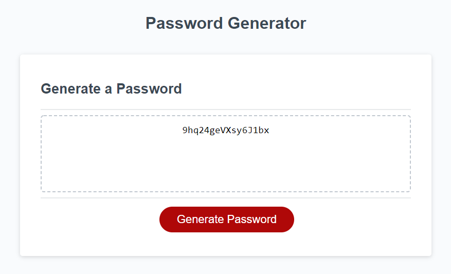

# PasswordGenerator

Generates a password based on criterea selected by the user. Asks the user for a length, and which specific character groups to include.

See deployment [here](https://jareddaniel95.github.io/PasswordGenerator/).